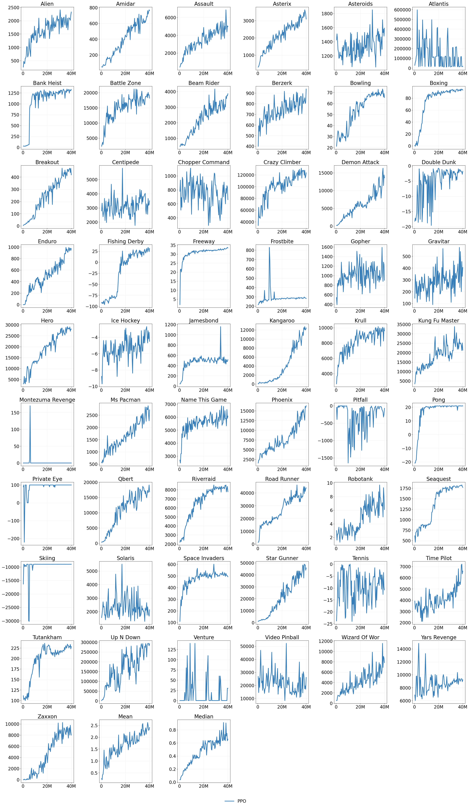

# PyTorch implementation of Proximal Policy optimization

PyTorch implementation of Proximal Policy optimization (PPO), [Proximal Policy Optimization Algorithms](https://arxiv.org/abs/1707.06347). 

## Installation

Clone GitHub repository and set up environment
```
git clone https://github.com/burchim/PPO-PyTorch.git && cd PPO-PyTorch
pip install -r requirements.txt
```

## Training

Train agent on a specific task:
```
env_name=atari-breakout python3 main.py -c configs/PPO/ppo.py
```

Train agent on all tasks:
```
./train_ppo_atari.sh
```

Visualize experiments
```
tensorboard --logdir ./callbacks
```

Overriding model config hyperparameters
```
override_config='{"dim_cnn": 48, "eval_env_params": {"episode_saving_path": "./videos"}}' run_name=dim_cnn_48 env_name=atari-breakout python3 main.py -c configs/PPO/ppo.py
```

## Evaluation

```
env_name=atari-breakout python3 main.py -c configs/PPO/ppo.py --mode evaluation
```

## Atari Results (40M env steps)

We averaged the evaluation score over 10 episodes.

 

## Acknowledgments

The 37 Implementation Details of Proximal Policy Optimization: [https://iclr-blog-track.github.io/2022/03/25/ppo-implementation-details](https://iclr-blog-track.github.io/2022/03/25/ppo-implementation-details)